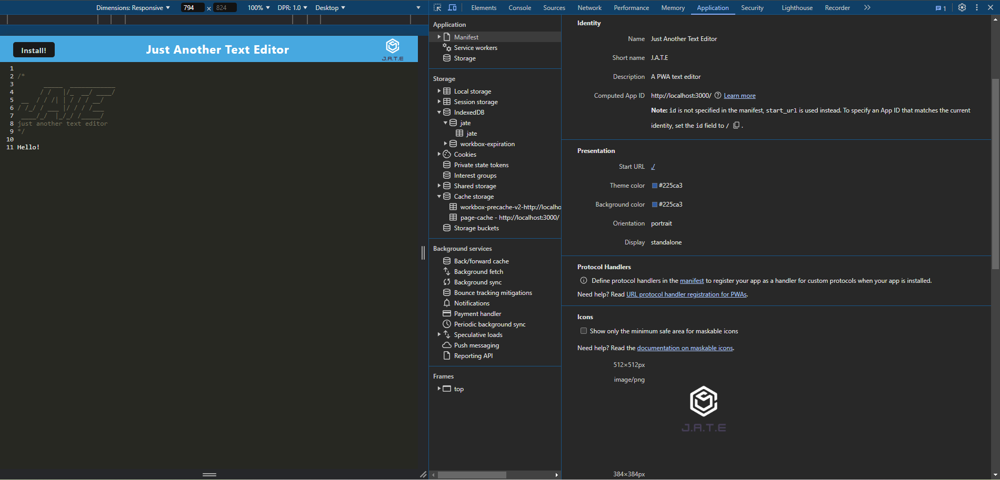
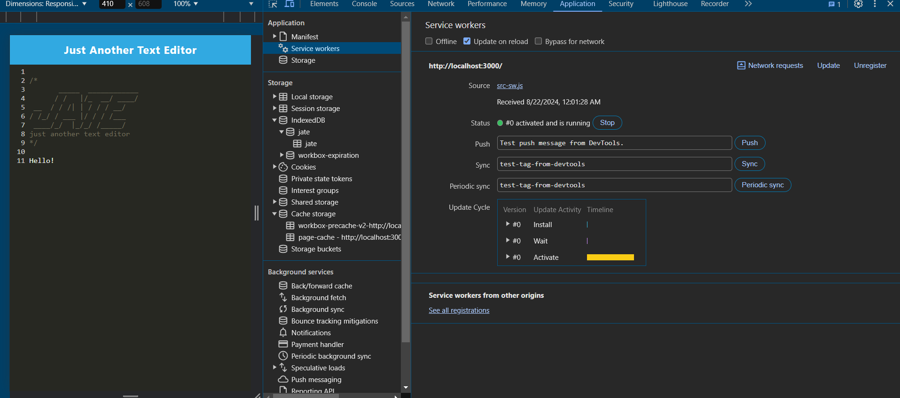

# PWA Text Editor <!-- omit in toc -->


## Description \*\*\* <!-- omit in toc -->

## Table of Contents <!-- omit in toc -->

- [User Story](#user-story)
- [Acceptance Criteria](#acceptance-criteria)
- [Technologies Used](#technologies-used)
- [Features](#features)
- [Installation](#installation)
- [Usage](#usage)
  - [Screenshots](#screenshots)
- [Tests](#tests)
- [Links](#links)
- [Credits](#credits)
- [License](#license)
- [Questions](#questions)

## User Story

```md
AS A developer
I WANT to create notes or code snippets with or without an internet connection
SO THAT I can reliably retrieve them for later use
```

## Acceptance Criteria

```md
GIVEN a text editor web application
WHEN I open my application in my editor
THEN I should see a client server folder structure
WHEN I run `npm run start` from the root directory
THEN I find that my application should start up the backend and serve the client
WHEN I run the text editor application from my terminal
THEN I find that my JavaScript files have been bundled using webpack
WHEN I run my webpack plugins
THEN I find that I have a generated HTML file, service worker, and a manifest file
WHEN I use next-gen JavaScript in my application
THEN I find that the text editor still functions in the browser without errors
WHEN I open the text editor
THEN I find that IndexedDB has immediately created a database storage
WHEN I enter content and subsequently click off of the DOM window
THEN I find that the content in the text editor has been saved with IndexedDB
WHEN I reopen the text editor after closing it
THEN I find that the content in the text editor has been retrieved from our IndexedDB
WHEN I click on the Install button
THEN I download my web application as an icon on my desktop
WHEN I load my web application
THEN I should have a registered service worker using workbox
WHEN I register a service worker
THEN I should have my static assets pre cached upon loading along with subsequent pages and static assets
WHEN I deploy to Render
THEN I should have proper build scripts for a webpack application
```

## Technologies Used

- **HTML**: For structuring the application layout.
- **CSS**: For styling and enhancing the user interface and components
- **JavaScript (ES6+)**: Core logic and functionality, including async/await for handling asynchronous operations.
- IndexedDB: Browser-based database used for storing and retrieving text editor content locally in the browser.
- **`idb` package**: A lightweight wrapper around IndexedDB, simplifying database operations for easier data management.
- **Webpack**: Module bundler used for compiling JavaScript and CSS as well as generating the necessary service worker and `manifest.json` files.
- **Babel**: JavaScript compiler that enables the use of modern JavaScript features across different browsers.
- **Workbox**: Library used for creating and managing service workers, enabling offline functionality and caching.
- **`WebpackPwaManifest` Plugin**: For automatically generating the `manifest.json` file required for PWA installation and functionality.
- **Node.js**: JavaScript runtime environment for server-side scripting.
- **Express.js**: Web application framework for managing server-side logic.
- **Concurrently**: Utility to run multiple commands concurrently, used to manage server and client-side processes during development.

## Features

- **Offline Capability**: Users can seamlessly create, edit, and save text documents without an internet connection, thanks to service workers and IndexedDB integration.
- **Auto-Save Functionality**: Automatically saves content and stores it locally when a user clicks off the DOM window, ensuring no data is lost.
- **PWA Features**: Includes a service worker for offline functionality and a web app manifest for installation.
- **PWA Installation**: The application can be installed on your desktop or mobile device as a Progressive Web App (PWA), providing a native app-like experience.
- **Modern JavaScript Support**: Utilizes async/await for handling asynchronous operations and other ES6+ features, ensuring smooth and efficient operations and performance.
- **Data Persistence**: Content is securely stored in IndexedDB, allowing for consistent retrieval across sessions.
- **User-friendly Interface**: A clean and intuitive user interface for creating and managing text documents.
- **Responsive Design**: Optimized for use on both desktop and mobile devices.

## Installation

There is no installation required if you would like to access the deployed PWA Text Editor application via Render, which is available here: <https://pwa-text-editor-s2uc.onrender.com>.

However, if you would prefer to run the program locally, you can do so by following these steps:

1. **Clone the Repository**:

   ```bash
   git clone https://github.com/vaughanknouse/PWA-Text-Editor.git
   ```

2. **Install Node.js**: Ensure that the current version of Node.js is installed on your machine.

3. **Navigate to the Project Directory**:

   ```bash
    cd PWA-Text-Editor
   ```

4. **Install Dependencies**:

   ```bash
   npm install
   ```

## Usage

To use the deployed PWA Text Editor application, visit the following link hosted on Render: <https://pwa-text-editor-s2uc.onrender.com>.

If you would like to use the application locally, follow these steps after completing the installation:

1. **Start the server**: Invoke the application using the following command:

   ```bash
    npm run start
   ```

2. **Navigate to the Application**: Once the application is running, open a browser window and navigate to <http://localhost:3000>. This will show the locally deployed PWA Text Editor application allowing you to start writing notes or code snippets.

### Screenshots

The following screenshots demonstrate the application's functionality and appearance:

**Image of the deployed application with some text content stored:**


**Image of the application's `manifest.json` file:**



**Image of the application's registered service worker:**



**Image of the application's IndexedDB storage:**


## Tests

There is no testing involved for this application.

## Links

GitHub Repository: <https://github.com/vaughanknouse/PWA-Text-Editor>

Render Deployed Application Link: <https://pwa-text-editor-s2uc.onrender.com>

## Credits

Used the following starter code and sources as tutorials and guidelines:

[Starter code repository provided by UT Austin Coding Boot Camp](https://github.com/coding-boot-camp/cautious-meme)

[Webpack Documentation](https://webpack.js.org/)

[Workbox Documentation](https://developer.chrome.com/docs/workbox/the-ways-of-workbox/#using-a-bundler)

[IndexedDB Documentation](https://www.npmjs.com/package/idb)

[concurrently Documentation](https://www.npmjs.com/package/concurrently)

[ChatGPT](https://chatgpt.com/?oai-dm=1)

[Xpert Learning Assistant](https://bootcampspot.instructure.com/courses/5293/external_tools/313)

## License

This project is licensed under the MIT license. For more information, please visit [this link](https://opensource.org/licenses/MIT).

## Questions

For any questions or feedback, please contact me via email at <vaughanknouse@gmail.com>.

Additionally, you can find me on GitHub at [vaughanknouse](https://github.com/vaughanknouse).
